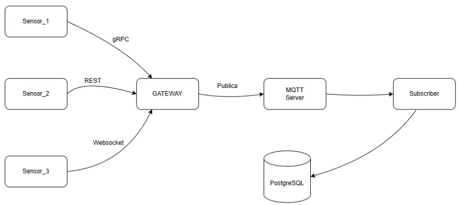

# iot_health_center
### Descripción del sistema
Este proyecto implementa un sistema de IoT para el sector de salud que recopila datos de sensores médicos simulados, se transmite a través de un Gateway IoT y se almacena en una base de datos PostgreSQL para su analisís. Este sistema hace uso del protocolo MQTT para la comunicación entre el Gateway y el suscriptor.

### Componentes del sistema
1. ### Sensores:
    - __SensorGRPC:__ Envía los datos de temperatura corporal mediante  el protocolo gRPC.
    - __SensorRest:__ Envía datos de presión arterial mediante el protocolo REST.
    - __SensorwS:__ Envía datos de ritmo cardíaco mediante el protocolo Websocket.
2. ### IoT_Gateway
Recibe los datos de los sensores (por gRPC o REST), los procesa y los publica en un topic MQTT (salud/datos) para su posterior almacenamiento. Actúa como puente entre los sensores y el resto del sistema.

3. ### Broker MQTT (Mosquitto)
Es el intermediario de mensajería. Se encarga de recibir y distribuir los mensajes publicados por el gateway a todos los suscriptores interesados. 

4. ### MQTT Subscriber
Se suscribe al tópico MQTT donde se publican los datos médicos. Cada mensaje recibido es insertado en la base de datos PostgreSQL para su almacenamiento y análisis posterior.

5. ### Base de Datos (PostgreSQL)
Almacena toda la información recibida de los sensores, organizada por paciente y con su respectiva marca temporal. Es la base del sistema de almacenamiento para análisis futuros.
### Arquitectura del sistema

### Diseño base de datos

### Puertos utilizados
- __Gateway:__
    - _gRPC:_ Port  50051
    - _REST:_ Port  8000
    - _Websocket:_ Port  5000
- __MQTT Broker:__ Port  1883
- __postgres:__ Port  5432


### Estructura del Proyecto

```
iot_health_center/
│
├── docker-compose.yml              # Orquestación general
│
├── IoT_Gateway/                    # Gateway central
│   ├── Dockerfile
│   ├── requirements.txt
│   ├── gateway.py
│   ├── grpc_handler.py             # Manejo de peticiones gRPC
│   └── sensor.proto                # Definición del servicio gRPC
│
├── mosquitto/                      # Broker MQTT (Mosquitto)
│   ├── config/mosquitto.conf
│   └── data/mosquitto.db
│
├── MQTT_Subscriber/                # Cliente MQTT que guarda en DB
│   ├── Dockerfile
│   ├── requirements.txt
│   └── subscriber.py
│
├── Sensores/
│   ├── SensorGRPC/                 # Sensor usando gRPC
│   │   ├── Dockerfile
│   │   ├── requirements.txt
│   │   ├── client.py
│   │   └── sensor.proto
│   ├── SensorRest/                 # Sensor usando REST
│   │   ├── Dockerfile
│   │   ├── requirements.txt
│   │   └── client.py
│
├── DB/
│   └── init.sql                    # Script para crear tablas
│
└── README.md

```
### Prerrequisitos
- Docker y Docker Compose

### Ejecución
1.  Inicia los servicios con Docker Compose:
   ```bash
   docker-compose up --build
   ```
2. Para parar los contenedores
  ```bash
   docker-compose down
   ```
### Verificación del funcionamiento

Al iniciar el sistema, los sensores comienzan a enviar datos automáticamente. Esta información es recibida por el gateway, que la publica en los tópicos correspondientes del broker MQTT. A su vez, el subscriptor MQTT escucha estos mensajes y los almacena en la base de datos PostgreSQL para su posterior consulta. Todos estos comportamientos pueden observarse en tiempo real a través de los logs de cada contenedor, lo que permite verificar que la comunicación y el flujo de datos se están ejecutando correctamente. Para consultar los datos almacenados, se puede ingresar al contenedor de la base de datos y  luego ejecutar la o las consultas correspondientes.


